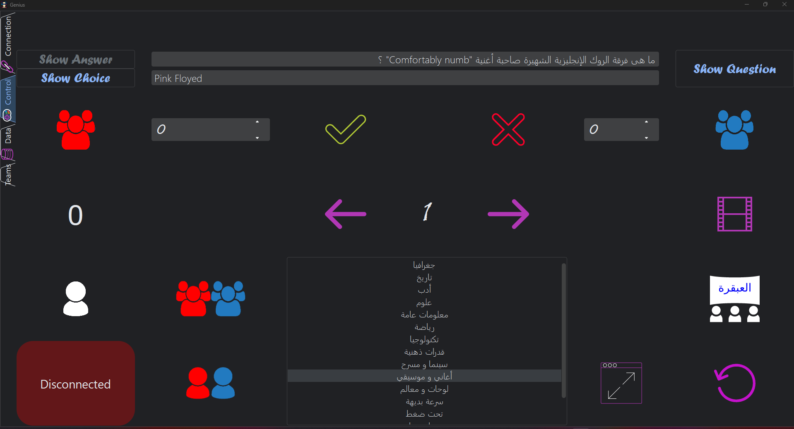
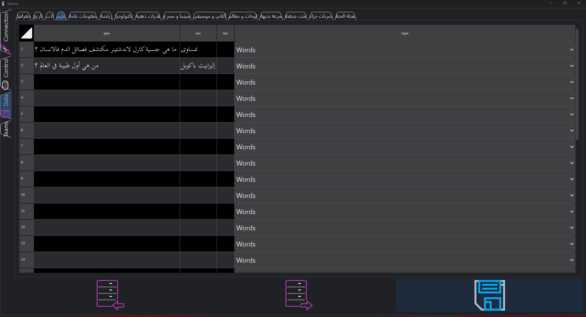
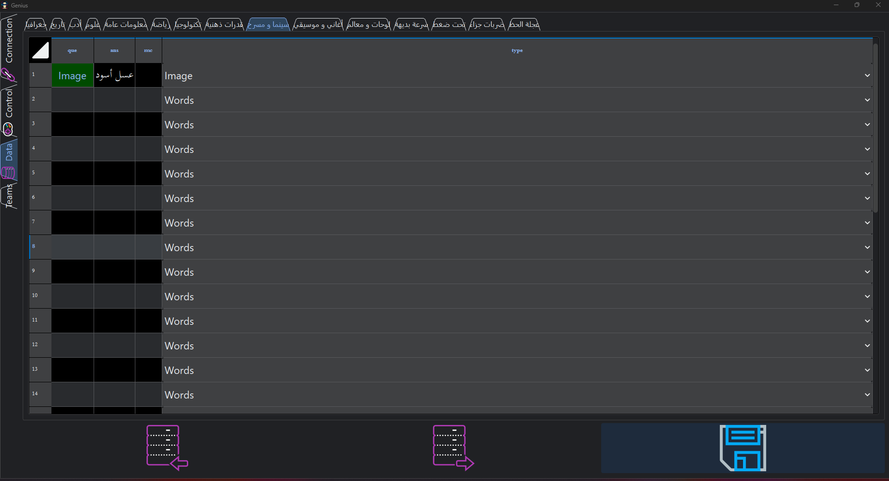
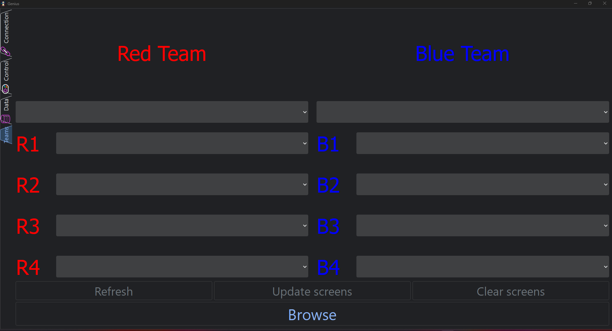
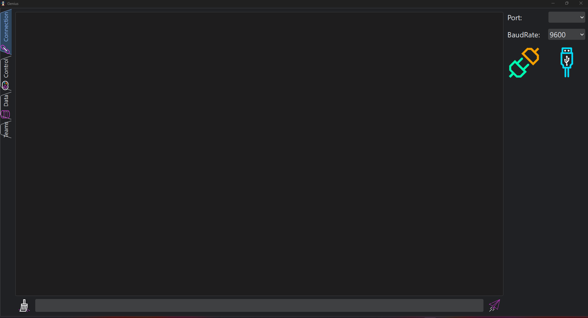
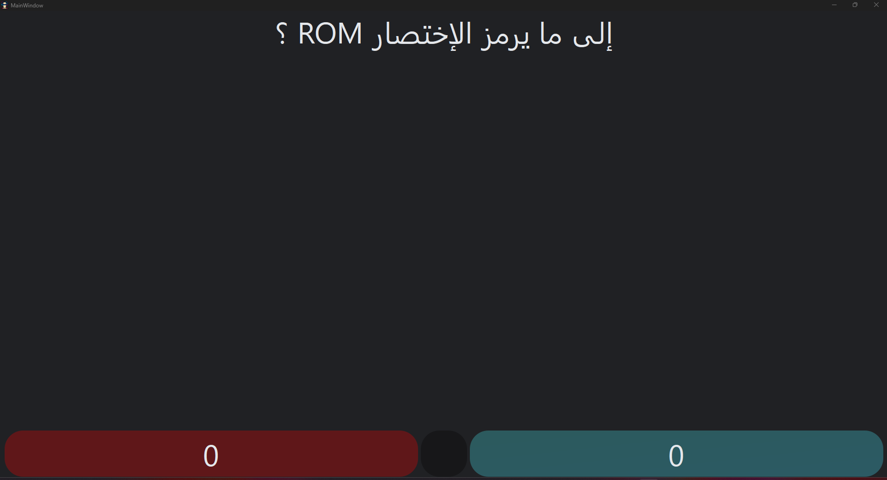
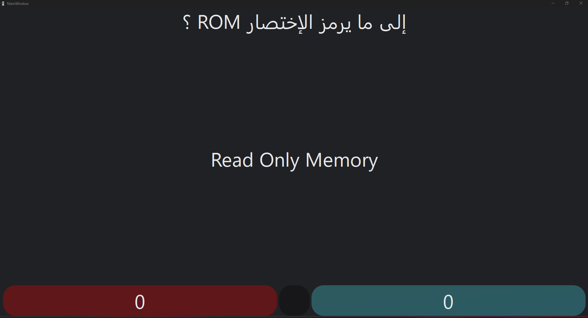
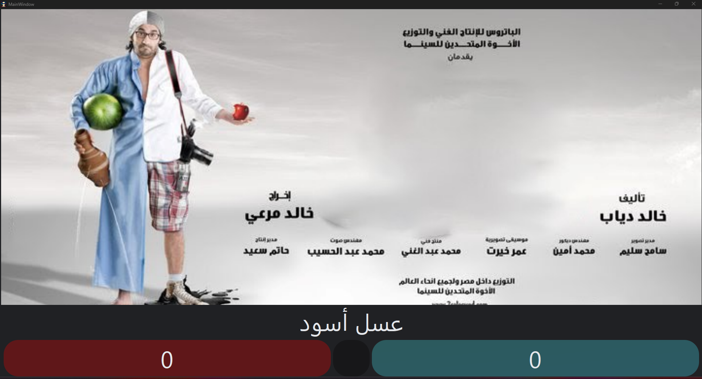

# 🎓 Genius Quiz App — PyQt6-Based Platform

[](https://www.python.org/)
[](https://pypi.org/project/PyQt6/)
[](https://mosquitto.org/)
[](LICENSE)

> **Genius Quiz** is a full-featured multimedia quiz game built with **PyQt6**, integrating image, audio, video, and buzzer-based questions. It supports team competition, MQTT-connected tablets for players and team names, and hardware buzzer input through Arduino over USB.

---

## 🧠 Features

- ✅ Word, image, song questions
- 🖥️ Dual-screen display with Cinema mode
- 🧩 Excel import/export for questions and teams
- ⏱️ Countdown timers with buzzer control
- 🧠 Red & Blue team selection and score tracking
- 🔌 USB Serial (UART) integration with Arduino
- 📡 MQTT for displaying questions on **12 tablets**
- 📱 Kotlin Android app included for tablets

---

## 📱 Tablet Integration (12 Tablets)

This app supports a real-time distributed display system using **12 Android tablets** running a Kotlin app:

- **10 Individual Tablets**:
  - 5 for Red team (e.g., topics: `Red/R1`, `Red/R2`, ..., `Red/R5`)
  - 5 for Blue team (`Blue/B1`, ..., `Blue/B5`)
  - Each shows the individual name, round, and quiz updates

- **2 Team Tablets**:
  - `Red/Team` and `Blue/Team`
  - Display team name and score

> The Kotlin Android app is in the `android-tablet-app/` folder.
Each tablet subscribes to a unique MQTT topic to receive updates.

---

## 🔌 Arduino Buzzer Integration

The app is connected to a **hardware buzzer system** via an Arduino board over USB Serial:

- The Arduino listens for physical buzzer presses
- When a button is pressed, it sends a character (like `R`, `B`, etc.) via UART
- The app receives and processes this input to lock the question, play sounds, and show visual cues

> ⚠️ The Arduino C++ code is **not included** in the repo. You can define your own logic to send serial characters for Red, Blue, or individual buzzers.

---

## 📂 Project Structure

```
GeniusQuizApp/
├── run.py                         # Main entry point to launch the app
├── requirements.txt               # Python dependencies (installed via `pip`)
├── LICENSE                        # Project license (MIT)
├── README.md                      # Project documentation (you’re here!)
│
├── src/                           # Source code for the application
│   ├── app.py                     # Application entry point (initializes UI and modules)
│   ├── core/                      # Core application logic
│   │   ├── data_handler.py        # Handling of Excel/JSON files and material loading
│   │   ├── json_loader.py         # Static config loading for categories and material types
│   │   ├── mqtt_control.py        # MQTT logic (client connection and publishing)
│   │   ├── serial_control.py      # Serial integration for Arduino buzzer communication
│   │   └── sound_engine.py        # Audio playback logic (Pygame integration)
│   ├── gui/                       # GUI logic with PyQt6 components
│   │   ├── main_window.py         # Main window UI (home of the quiz)
│   │   ├── cinema_screen.py       # Fullscreen mode for large display (questions and timers)
│   │   ├── table_editor.py        # Custom table logic (editing quiz data in the UI)
│   │   ├── team_selector.py       # Team management (import, select teams)
│   │   └── video_player.py        # Video playback inside the PyQt6 window
│   ├── widgets/                   # Custom UI components/widgets
│   │   ├── __init__.py            # Makes widgets a Python package
│   │   ├── table_button.py        # Custom button widget for quiz question rows
│   │   └── table_combo.py         # Custom combo-box widget (for question type selection)
│   └── resources/                 # Resources (UI files, icons, sounds, videos, etc.)
│       ├── configs/               # JSON configuration files for categories and mappings
│       ├── sounds/                # Sound files for quiz events (correct, wrong, etc.)
│       ├── videos/                # Video files for video-based quiz questions
│       └── ui/                    # UI definition files (.ui created in Qt Designer)
│
├── assets/                        # Project assets (images, etc.)
│   ├── screenshots/               # Screenshots for README documentation
│   │   ├── screen1.png            # Example screenshot of the app’s UI
│   │   ├── screen2.png            # Another example screenshot
│   │   └── ...                    # Additional screenshots
│   └── demo_thumbnail.jpg         # Thumbnail image for YouTube video demo
│
├── data/                          # Quiz data (questions, answers, and media)
│   ├── Episode_1/                 # Folder for data of a specific episode
│   │   ├── Episode_1.xlsx         # Excel file with questions, answers, and types
│   │   ├── [media files]          # Images, audio, videos for the questions
│   │   └── [others]               # Any other files related to the episode
│
├── android-tablet-app/            # Kotlin Android app for tablet integration (12 tablets)
│   ├── [Kotlin source code here]  # Files for the Android app that runs on tablets
│
├── qdarktheme/                    # A library used to apply dark theme
│
└── __init__.py                    # Makes GeniusQuizApp a Python package

```

---

## 📸 Screenshots

|  |  |  |  |
|:--:|:--:|:--:|:--:|
|  |  |  |  |

---

## 🎥 Demo Video

[](https://www.youtube.com/watch?v=_hECEB3RVW0&list=PL40MEc9AciPCvp9i2mXNj35zSrlaTzCnk&index=11)

---

## 📦 Setup Instructions

1. **Install dependencies**:
```bash
pip install -r requirements.txt
```

2. **Connect hardware (optional)**:
   - USB-connected Arduino for buzzers
   - MQTT broker running locally or externally

3. **Launch the app**:
```bash
python run.py
```

4. **Load the folder from the `data/` directory** containing the Excel file with questions and answers. 
   - If the answer is text, it will be stored directly in the Excel file.
   - If the answer is an image or audio, the Excel file will reference the respective media file by name.

---

## 📜 License

This project is licensed under the [MIT License](LICENSE).

---

## 👩‍💻 Author

**Hytham Tag**  
_Educator, AI & Embedded Systems Enthusiast_

---

*Built for competitive university quizzes between teams 🚀*
